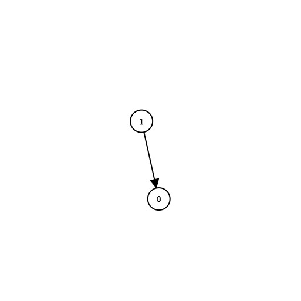
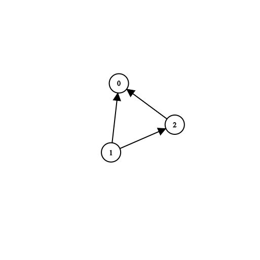

# 201215 1462 Course Schedule IV

There are a total of `n` courses you have to take, labeled from `0` to `n-1`.

Some courses may have direct prerequisites, for example, to take course 0 you have first to take course 1, which is expressed as a pair: `[1,0]`

Given the total number of courses `n`, a list of direct `prerequisite` **pairs** and a list of `queries` **pairs**.

You should answer for each `queries[i]` whether the course `queries[i][0]` is a prerequisite of the course `queries[i][1]` or not.

Return *a list of boolean*, the answers to the given `queries`.

Please note that if course **a** is a prerequisite of course **b** and course **b** is a prerequisite of course **c**, then, course **a** is a prerequisite of course **c**.

 

**Example 1:**



```
Input: n = 2, prerequisites = [[1,0]], queries = [[0,1],[1,0]]
Output: [false,true]
Explanation: course 0 is not a prerequisite of course 1 but the opposite is true.
```

**Example 2:**

```
Input: n = 2, prerequisites = [], queries = [[1,0],[0,1]]
Output: [false,false]
Explanation: There are no prerequisites and each course is independent.
```

**Example 3:**



```
Input: n = 3, prerequisites = [[1,2],[1,0],[2,0]], queries = [[1,0],[1,2]]
Output: [true,true]
```

**Example 4:**

```
Input: n = 3, prerequisites = [[1,0],[2,0]], queries = [[0,1],[2,0]]
Output: [false,true]
```

**Example 5:**

```
Input: n = 5, prerequisites = [[0,1],[1,2],[2,3],[3,4]], queries = [[0,4],[4,0],[1,3],[3,0]]
Output: [true,false,true,false]
```

 

**Constraints:**

- `2 <= n <= 100`
- `0 <= prerequisite.length <= (n * (n - 1) / 2)`
- `0 <= prerequisite[i][0], prerequisite[i][1] < n`
- `prerequisite[i][0] != prerequisite[i][1]`
- The prerequisites graph has no cycles.
- The prerequisites graph has no repeated edges.
- `1 <= queries.length <= 10^4`
- `queries[i][0] != queries[i][1]`


## 201215 Code

```python
from collections import deque

class Solution:
    def dfs(self, s, e, adj, cnt):
        visited = [0] * cnt
        visited[s] = 1
        stack = deque()
        stack.append(s)
        while stack:
            el = stack.pop()
            if el == e:
                return True
            for node in adj[el]:
                if not visited[node]:
                    visited[node] = 1
                    stack.append(node)
        return False

    def checkIfPrerequisite(self, n, prerequisites, queries):
        answer = []
        adj = {i: [] for i in range(n)}
        for prerequisite in prerequisites:
            s, e = prerequisite[0], prerequisite[1]
            adj[s].append(e)

        for query in queries:
            if self.dfs(query[0], query[1], adj, n):
                answer.append(True)
            else:
                answer.append(False)
        return answer
```

